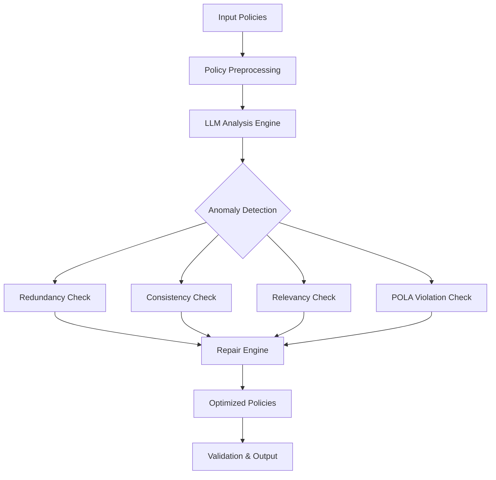

# 🔐 Access Control Policy Analyzer

<div align="center">


**Intelligent analysis and repair of access control policies using AI**

</div>

## ✨ Overview

A sophisticated **Access Control Policy (ACP) analysis and repair tool** designed to detect and fix security anomalies in access control rules. The system leverages **Large Language Models (LLMs)** to intelligently analyze policies for redundancy, inconsistency, irrelevancy, and Principle of Least Astonishment (POLA) violations.

This project bridges the gap between traditional security analysis and modern AI capabilities, providing automated, intelligent policy optimization.

## 🎯 Key Features

### 🔍 **Advanced Anomaly Detection**
- **Redundancy Analysis**: Identifies duplicate or overlapping rules
- **Inconsistency Detection**: Finds contradictory permissions and conflicts
- **Irrelevancy Filtering**: Removes rules that have no practical effect
- **POLA Violations**: Detects creation/modify privileges without corresponding access

### 🤖 **AI-Powered Analysis**
- **Multi-LLM Support**: Works with GPT, DeepSeek, Mistral, and other models
- **Context-Aware Reasoning**: Understands policy semantics and relationships
- **Automated Repair**: Generates optimized policy sets based on analysis
- **Explainable Results**: Provides clear justifications for all modifications

### ⚙️ **Professional Tooling**
- **Modular Architecture**: Easy to extend with custom analyzers
- **Batch Processing**: Handle large policy sets efficiently
- **Validation Framework**: Ensures repaired policies maintain security properties
- **Cross-Platform**: Works on Windows, Linux, and macOS

## 📋 Supported Rule Types

The analyzer supports comprehensive ACP rule syntax including:

```bash
# Entity-level rules
grant|deny traverse|create|delete on nodes|relationships (variable:Label) [conditions]

# Attribute-level rules  
grant|deny modify|add|remove|read{attribute|*} on nodes|relationships (variable:Label) [conditions]
```

## 🏗️ Architecture

<div align="center">



</div>

## 🚀 Quick Start

### 1. **Clone & Setup**
```bash
git clone https://github.com/adil-ber/graph-acp-llm-analysis.git
cd graph-acp-llm-analysis

# Create virtual environment
python -m venv venv

# Activate (Linux/Mac)
source venv/bin/activate

# Activate (Windows)
venv\Scripts\activate
```

### 2. **Install Dependencies**
```bash
pip install -r requirements.txt
```

### 3. **Configure API Settings**
Create `config.py` with your API credentials:

```python
# config.py
#APP PARAMETERS
API_KEY = "ENTER_YOUR_API_KEY_HERE"
API_URL = "ENTER_YOUR_YOUR_API_URL_HERE"


HEADERS = {
    "Authorization": f"Bearer {API_KEY}",
    "Content-Type": "application/json"
}

MODELS = ["openai/gpt-oss-120b"]  # Change as needed: "openai/gpt-oss-120b", "google/gemini-2.5-flash",...

POLICIES = ["policy1"]  # Change as needed: "policy1", "policy2", ...

PROPERTY="relev" # Change as needed: "relev", "consist", "la", or "all"
```

### 4. **Run Analysis**
```bash
# Analyze a single policy file
python main.py --input policies/acl_rules.csv --output repaired_rules.csv

# Analyze directory of policies
python main.py --dir input_policies/ --output_dir repaired_policies/

# Enable verbose debugging
python main.py --input rules.csv --output fixed.csv --verbose --debug
```

## 📁 Project Structure

```
acp-analyzer/
├── 📁 policy_preprocessing/     # Policy normalization and parsing
│   ├── policy_preprocessing.py
│   ├── Policy.py
├── 📁 policy_sets/             # Example datasets
│   ├── input_policies/         # Raw policy files
│   ├── repaired_policies/      # Optimized outputs
│   └── expected_policies/      # Ground truth for validation
├── 📁 prompts/                 # LLM prompt templates
│   ├── prompt1_satisfiability.txt
│   ├── prompt2_redundancy.txt
│   ├── prompt3_consistency.txt
│   └── prompt4_astonishment.txt
├── 📁 few_shots/              # Few-shot learning examples
│   ├── few_shots1_satisfiability.txt
│   ├── few_shots2_redundancy.txt
│   └── few_shots3_consistency.txt
│   └── few_shots4_astonishment.txt
├── 📁 analyzers/              # LLM API integrations and Core analysis modules
│   ├── astonishment_analyzer.py
│   ├── consistency_analyzer.py
│   ├── llm_analyzer.py
│   ├── relevancy__analyzer.py
├── 📁 evaluation/              # Tasks evaluation and accuracy measuring
│   ├── redundancy_analyzer.py
│   ├── consistency_analyzer.py
├── config.py                  # API and runtime configuration
├── main.py                    # Entry point
├── requirements.txt           # Dependencies
└── README.md                  # This file
```

## 🔬 Analysis Examples


### **Irrelevancy Detection**
```python
# Input Rules (Redundant)
R1: grant traverse on nodes (u:User) to member;
R2: grant traverse on nodes (u:User) to member where u.age>=18;

# Analysis Result: ❌ IRRELEVANT
# R2 is included in R1
# Repair: Remove R2
```

### **Inconsistency Detection**
```python
# Input Rules (Redundant)
R1: grant modify{age} on nodes (u:User) to member;
R2: deny traverse on nodes (u:User) to member where u.age>=18;

# Analysis Result: ❌ INCONSISTENT
# R2 can be bypassed by using R1
# Repair: Remove R1
```


### **Least-Astonishment Violation Detection**
```python
# Input Rule (Violation)
R10: grant create on relationships (r:REPORTS_TO) where r.level > 3 to member;

# Analysis Result: ❌ ASTONISHMENT
# Missing corresponding: grant traverse on relationships (r:REPORTS_TO)
# Repair: Rule removed - cannot create inaccessible entities
```

## 🧪 Testing & Validation

```bash
# Run unit tests
python -m pytest tests/ -v

# Run integration tests
python tests/integration_test.py

# Validate repaired policies
python validate.py --input repaired_policies/ --expected expected_policies/
```


## 📧 Contact & Support

**Project Maintainer**: Adil Ber  
**Email**: [adil.bereksi@gmail.com](mailto:adil.bereksi@gmail.com)  
**GitHub Issues**: [Report a Bug](https://github.com/adil-ber/acp-analyzer/issues)  
**Documentation**: [Wiki](https://github.com/adil-ber/acp-analyzer/wiki)

---

<div align="center">

### ⭐ **Star this repo if you find it useful!** ⭐

**Built with ❤️ for the DB community**

</div>